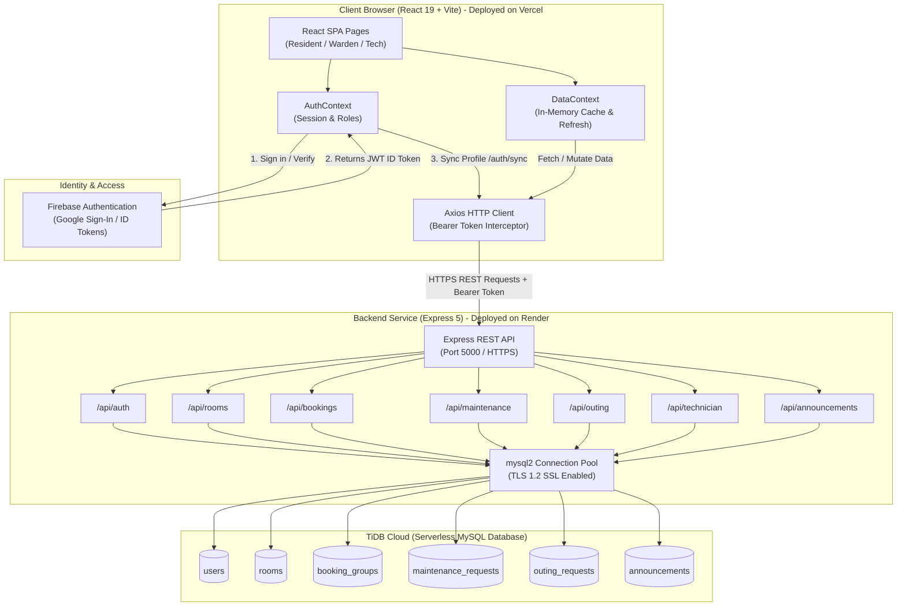
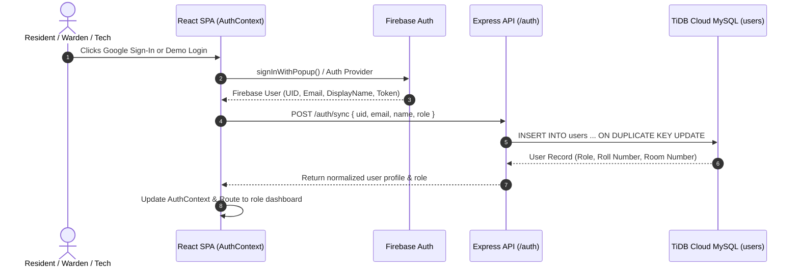
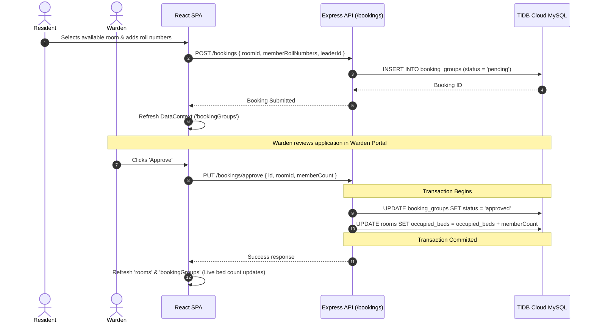
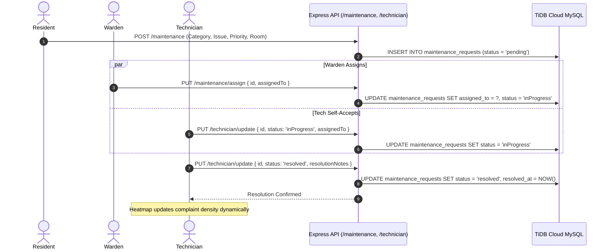
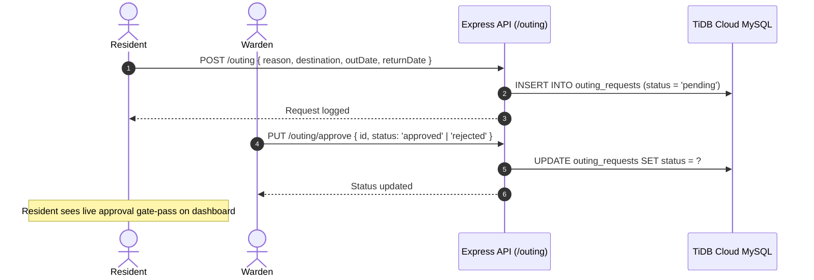

<div align="center">

# 🏠 SmartHostel

### Transparent, Fair, and Intelligent Hostel Management System

[](https://react.dev/)
[](https://vitejs.dev/)
[](https://nodejs.org/)
[](https://tidbcloud.com/)
[](https://firebase.google.com/)
[](https://tailwindcss.com/)
[](https://bookmyroom-zyro.vercel.app)
[](https://smarthostel-api.onrender.com)
[](#license)

**[🚀 Live Demo](https://bookmyroom-zyro.vercel.app)** &nbsp;•&nbsp; **[⚡ API Backend](https://smarthostel-api.onrender.com)**

</div>

---

**SmartHostel** is a modern, full-stack, role-based web application designed to streamline daily hostel operations. It empowers **Residents**, **Wardens**, and **Technicians** through intuitive workflows for room booking, live room & occupancy management, maintenance reporting with complaint heatmaps, outing approvals, and campus-wide announcements.

The application combines a high-performance **React 19 SPA (Vercel)** with a robust **Node.js/Express 5 REST API (Render)** and a resilient cloud-native relational database powered by **TiDB Cloud (Serverless MySQL)** with **Firebase Authentication** for identity management.

---

## 🔗 Live Deployments

| Component | Platform | URL |
|---|---|---|
| **Frontend Web App** | **Vercel** | [https://bookmyroom-zyro.vercel.app](https://bookmyroom-zyro.vercel.app) |
| **Backend REST API** | **Render** | [https://smarthostel-api.onrender.com](https://smarthostel-api.onrender.com) |
| **Cloud Database** | **TiDB Cloud (AWS ap-southeast-1)** | Serverless MySQL Cluster (SSL/TLS 1.2) |

---

## 📑 Table of Contents

- [Live Deployments](#-live-deployments)
- [Preview](#-preview)
- [Key Features by Role](#-key-features-by-role)
- [Tech Stack](#1-tech-stack)
- [Architecture & System Flow](#2-architecture--system-flow)
  - [High-Level Architecture](#21-high-level-architecture)
  - [Authentication & User Synchronization Flow](#22-authentication--user-synchronization-flow)
  - [Room Booking & Bed Allocation Flow](#23-room-booking--occupancy-allocation-flow)
  - [Maintenance & Complaint Resolution Flow](#24-maintenance--complaint-resolution-flow)
  - [Outing Permission & Approval Flow](#25-outing-permission--approval-flow)
- [Database Schema (MySQL / TiDB Cloud)](#3-database-schema-mysql--tidb-cloud)
- [Project Structure](#4-project-structure)
- [REST API Endpoints](#5-rest-api-endpoints)
- [Environment Variables](#6-environment-variables)
- [Installation & Local Setup](#7-installation--local-setup)
- [Database Initialization & Seeding](#8-database-initialization--seeding)
- [Running Locally](#9-running-the-app-locally)
- [Contributing](#contributing)
- [License](#license)

---

## 📸 Preview

<div align="center">
  
</div>

---

## ✨ Key Features by Role

### 👨‍🎓 Resident
- **Room Booking**: Real-time room availability browser with live occupancy visualizer; support for group bookings with co-resident roll numbers.
- **My Bookings**: Real-time status tracking for pending, approved, or rejected room reservations.
- **Maintenance Requests**: Instant issue reporting categorized by discipline (Electrical, Plumbing, Furniture, Wi-Fi, Cleaning) with custom urgency/priority levels.
- **Outing Requests**: Digital gate-pass requests with departure/arrival timestamps, destination, and purpose tracking.
- **Announcements**: Broadcast board for critical notices and administrative updates.

### 🛡️ Warden
- **Live Room Management**: Complete control to add rooms, configure capacities, update tariffs, free up occupied rooms, and delete rooms.
- **Booking Approvals**: Review room applications; single-click approval atomically updates room bed occupancy via MySQL transactions.
- **Maintenance Management**: Assign complaints to specific technicians and track resolution lifecycles.
- **Outing Approvals**: Approve or reject outing gate-passes with optional rejection explanations.
- **Announcements**: Post priority notices (Normal, Important, Urgent) accessible by all residents and staff.

### 🔧 Technician
- **Task Management Portal**: Dedicated dashboard displaying all unassigned and assigned maintenance tasks.
- **Resolution Workflow**: Self-assign complaints, add resolution notes, and mark tasks as resolved with completion timestamps.
- **Complaint Heatmap**: Visual floor-by-floor and room-by-room complaint density analysis powered by Recharts to pinpoint recurrent maintenance hotspots.

---

## 1. Tech Stack

| Layer | Technology | Details |
|---|---|---|
| **Frontend Framework** | **React 19.2** + **Vite 8.2** | High-performance SPA with client-side routing & code-splitting |
| **Styling & UI** | **Tailwind CSS 4.3** | Custom glassmorphism, responsive dark/light modes, micro-animations |
| **UI Components** | **Headless UI**, **React Icons**, **React Hot Toast** | Accessible dialogs, toast notifications, icon suites |
| **Data Visualization** | **Recharts 3.10** | Heatmaps and complaint density distribution charts |
| **Client State Management** | **React Context API** | Centralized `AuthContext`, `DataContext`, and `ThemeContext` |
| **HTTP Client** | **Axios** | Configured with automatic Firebase Bearer Token authentication interceptor |
| **Backend API** | **Node.js** + **Express 5.2** | Structured REST API with CORS, route splitting, and error handling |
| **Database** | **TiDB Cloud (Serverless MySQL)** | Distributed MySQL-compatible cloud database with connection pooling & TLS |
| **Database Driver** | **mysql2/promise** | Asynchronous promise-based connection pool with SSL support |
| **Authentication** | **Firebase Auth** | Google Sign-in & email auth with automated backend profile sync |
| **Deployment** | **Vercel** & **Render** | Frontend continuous deployment on Vercel; Express API hosted on Render |

---

## 2. Architecture & System Flow

### 2.1 High-Level Architecture

The following diagram illustrates how the frontend, authentication provider, REST API backend, and cloud database interact:



---

### 2.2 Authentication & User Synchronization Flow

SmartHostel combines the seamless UX of Firebase Authentication with the relational integrity of a MySQL database:



---

### 2.3 Room Booking & Occupancy Allocation Flow

Room booking features ACID transaction protection to avoid overbooking beds:



---

### 2.4 Maintenance & Complaint Resolution Flow



---

### 2.5 Outing Permission & Approval Flow



---

## 3. Database Schema (MySQL / TiDB Cloud)

The backend runs on **TiDB Cloud Serverless MySQL** with the following schema:

```sql
-- 1. Users Table
CREATE TABLE users (
  id VARCHAR(128) PRIMARY KEY,
  name VARCHAR(255) NOT NULL,
  email VARCHAR(255) UNIQUE NOT NULL,
  password VARCHAR(255) NULL,
  role ENUM('resident', 'warden', 'technician') NOT NULL DEFAULT 'resident',
  roll_number VARCHAR(100) NULL,
  phone VARCHAR(50) NULL,
  room_number VARCHAR(50) NULL,
  floor INT NULL,
  hostel VARCHAR(100) DEFAULT 'Main Hostel Block',
  created_at TIMESTAMP DEFAULT CURRENT_TIMESTAMP
) ENGINE=InnoDB;

-- 2. Rooms Table
CREATE TABLE rooms (
  id VARCHAR(64) PRIMARY KEY,
  room_number VARCHAR(50) UNIQUE NOT NULL,
  block VARCHAR(50) NOT NULL,
  floor INT NOT NULL DEFAULT 1,
  capacity INT NOT NULL DEFAULT 4,
  occupied_beds INT NOT NULL DEFAULT 0,
  type VARCHAR(50) DEFAULT 'Standard',
  gender VARCHAR(20) DEFAULT 'Co-ed',
  price_per_semester INT DEFAULT 25000,
  status VARCHAR(50) DEFAULT 'available',
  created_at TIMESTAMP DEFAULT CURRENT_TIMESTAMP
) ENGINE=InnoDB;

-- 3. Booking Groups Table
CREATE TABLE booking_groups (
  id VARCHAR(64) PRIMARY KEY,
  room_id VARCHAR(64) NOT NULL,
  room_number VARCHAR(50) NOT NULL,
  leader_id VARCHAR(128) NOT NULL,
  leader_roll VARCHAR(100) NULL,
  member_roll_numbers JSON NULL,
  status ENUM('pending', 'approved', 'rejected') NOT NULL DEFAULT 'pending',
  rejection_reason TEXT NULL,
  created_at TIMESTAMP DEFAULT CURRENT_TIMESTAMP,
  updated_at TIMESTAMP DEFAULT CURRENT_TIMESTAMP ON UPDATE CURRENT_TIMESTAMP
) ENGINE=InnoDB;

-- 4. Maintenance Requests Table
CREATE TABLE maintenance_requests (
  id VARCHAR(64) PRIMARY KEY,
  user_id VARCHAR(128) NULL,
  resident_name VARCHAR(255) NULL,
  resident_email VARCHAR(255) NULL,
  roll_number VARCHAR(100) NULL,
  room_number VARCHAR(50) NOT NULL,
  floor INT NULL,
  category VARCHAR(100) NOT NULL,
  issue TEXT NOT NULL,
  priority ENUM('low', 'medium', 'high') NOT NULL DEFAULT 'medium',
  status ENUM('pending', 'inProgress', 'resolved') NOT NULL DEFAULT 'pending',
  assigned_to VARCHAR(255) NULL,
  resolution_notes TEXT NULL,
  created_at TIMESTAMP DEFAULT CURRENT_TIMESTAMP,
  updated_at TIMESTAMP DEFAULT CURRENT_TIMESTAMP ON UPDATE CURRENT_TIMESTAMP,
  resolved_at TIMESTAMP NULL
) ENGINE=InnoDB;

-- 5. Outing Requests Table
CREATE TABLE outing_requests (
  id VARCHAR(64) PRIMARY KEY,
  user_id VARCHAR(128) NULL,
  resident_name VARCHAR(255) NOT NULL,
  resident_email VARCHAR(255) NULL,
  roll_number VARCHAR(100) NULL,
  room_number VARCHAR(50) NULL,
  reason TEXT NOT NULL,
  destination VARCHAR(255) NOT NULL,
  out_date VARCHAR(50) NOT NULL,
  return_date VARCHAR(50) NOT NULL,
  status ENUM('pending', 'approved', 'rejected') NOT NULL DEFAULT 'pending',
  created_at TIMESTAMP DEFAULT CURRENT_TIMESTAMP,
  updated_at TIMESTAMP DEFAULT CURRENT_TIMESTAMP ON UPDATE CURRENT_TIMESTAMP
) ENGINE=InnoDB;

-- 6. Announcements Table
CREATE TABLE announcements (
  id VARCHAR(64) PRIMARY KEY,
  title VARCHAR(255) NOT NULL,
  message TEXT NOT NULL,
  priority ENUM('normal', 'important', 'urgent') NOT NULL DEFAULT 'normal',
  author VARCHAR(255) DEFAULT 'Hostel Warden',
  created_at TIMESTAMP DEFAULT CURRENT_TIMESTAMP
) ENGINE=InnoDB;
```

---

## 4. Project Structure

```
hostel/
├── client/                              # Frontend React 19 + Vite Application
│   ├── src/
│   │   ├── main.jsx                      # App entry point with Context Providers
│   │   ├── App.jsx                       # Route registry with role guards
│   │   ├── context/
│   │   │   ├── AuthContext.jsx           # Firebase auth listener & MySQL sync
│   │   │   ├── DataContext.jsx           # In-memory centralized data store
│   │   │   └── ThemeContext.jsx          # Dark / Light theme provider
│   │   ├── services/
│   │   │   ├── api.js                    # Axios instance with auth interceptor
│   │   │   ├── booking.js                # Room booking API helpers
│   │   │   ├── rooms.js                  # Room management API helpers
│   │   │   ├── maintenance.js            # Maintenance request API helpers
│   │   │   ├── outing.js                 # Outing permission API helpers
│   │   │   └── technician.js             # Technician task API helpers
│   │   ├── firebase/
│   │   │   ├── config.js                 # Firebase Client SDK initialization
│   │   │   └── auth.js                   # Google sign-in & sign-out handlers
│   │   ├── components/                   # Navbar, RoleSelector, Modals, Badges...
│   │   └── pages/
│   │       ├── Login/                    # LoginPage & RoleSelector
│   │       ├── Register/                 # User registration page
│   │       ├── Resident/                 # Resident Dashboard, RoomBooking, MyBookings,
│   │       │                             # MaintenanceRequest, OutingRequest
│   │       ├── Warden/                   # Warden Dashboard, RoomManagement,
│   │       │                             # BookingApproval, MaintenanceMgmt, OutingApproval
│   │       └── Technician/               # Technician Dashboard, HeatmapPage
│   ├── .env                             # Local development environment variables
│   ├── .env.production                  # Production environment variables (Render backend URL)
│   ├── vite.config.js                   # Vite configuration with /api proxy & chunk splitting
│   ├── vercel.json                      # Single Page App rewrite rule for Vercel
│   └── package.json
│
├── server/                              # Backend Express 5 REST API
│   ├── config/
│   │   └── db.js                        # TiDB Cloud MySQL connection pool (mysql2)
│   ├── routes/
│   │   ├── auth.js                      # User profile sync, login, registration
│   │   ├── rooms.js                     # CRUD rooms & occupancy management
│   │   ├── bookings.js                  # Booking submission & transactional approval
│   │   ├── maintenance.js               # Maintenance ticketing & technician assignment
│   │   ├── outing.js                    # Outing request submission & warden approvals
│   │   ├── technician.js                # Technician tasks & status resolution
│   │   └── announcements.js             # Campus announcements management
│   ├── index.js                         # Express bootstrap, CORS & route mounting
│   ├── initDb.js                        # Automated table creation & seed script
│   ├── .env                             # Database connection credentials
│   ├── .env.example                     # Reference environment configuration
│   └── package.json
│
└── README.md
```

---

## 5. REST API Endpoints

All endpoints are mounted under `/api/*` (as well as the root for convenience):

### Authentication (`/api/auth`)
- `POST /api/auth/sync` — Synchronize Firebase user profile to MySQL database
- `POST /api/auth/login` — Authenticate users with credentials and role
- `POST /api/auth/register` — Register a new resident, warden, or technician
- `GET /api/auth/profile/:identifier` — Fetch profile by UID or email

### Room Management (`/api/rooms`)
- `GET /api/rooms` — Fetch all hostel rooms with live bed occupancy
- `GET /api/rooms/:id` — Fetch details for a specific room
- `POST /api/rooms` — Create a new room (Warden)
- `PUT /api/rooms/:id` — Update room details, capacity, or occupancy (Warden)
- `PUT /api/rooms/:id/free` — Reset room beds to 0 and mark available (Warden)
- `DELETE /api/rooms/:id` — Remove a room record (Warden)

### Bookings (`/api/bookings`)
- `GET /api/bookings` — Fetch all booking applications
- `GET /api/bookings/status/:uid` — Fetch booking status for a specific student
- `POST /api/bookings` — Submit a new room booking (Resident)
- `PUT /api/bookings/approve` — Approve booking & atomically update room beds (Warden)
- `PUT /api/bookings/:id/reject` — Reject a booking request with feedback (Warden)

### Maintenance (`/api/maintenance` & `/api/technician`)
- `GET /api/maintenance/all` — Fetch all maintenance tickets
- `POST /api/maintenance` — Submit a new maintenance ticket (Resident)
- `PUT /api/maintenance/assign` — Assign a technician to a complaint (Warden)
- `PUT /api/maintenance/complete` — Mark a ticket as resolved (Technician)
- `GET /api/technician/tasks` — Fetch tasks filtered by technician or pending status
- `PUT /api/technician/update` — Update task progress, notes, or resolution

### Outings (`/api/outing`)
- `GET /api/outing/all` — List all student outing requests
- `POST /api/outing` — Submit a digital gate-pass request (Resident)
- `PUT /api/outing/approve` — Approve or reject an outing request (Warden)

### Announcements (`/api/announcements`)
- `GET /api/announcements` — List latest notices
- `POST /api/announcements` — Broadcast a new announcement (Warden)
- `DELETE /api/announcements/:id` — Delete an announcement (Warden)

---

## 6. Environment Variables

### Client (`client/.env`)

```env
VITE_FIREBASE_API_KEY=your_firebase_api_key
VITE_FIREBASE_AUTH_DOMAIN=your_project.firebaseapp.com
VITE_FIREBASE_PROJECT_ID=your_project_id
VITE_FIREBASE_STORAGE_BUCKET=your_project.firebasestorage.app
VITE_FIREBASE_MESSAGING_SENDER_ID=your_sender_id
VITE_FIREBASE_APP_ID=your_app_id
VITE_API_BASE_URL=http://localhost:5000
```

> In production (`client/.env.production`), `VITE_API_BASE_URL` points to the Render backend:  
> `VITE_API_BASE_URL=https://smarthostel-api.onrender.com`

### Server (`server/.env`)

```env
PORT=5000
DB_HOST=gateway01.ap-southeast-1.prod.aws.tidbcloud.com
DB_PORT=3306
DB_USER=your_tidb_username
DB_PASSWORD=your_tidb_password
DB_NAME=hostel_management
DB_SSL=true
```

---

## 7. Installation & Local Setup

### 1. Clone the repository
```bash
git clone https://github.com/Mowlieswaran-G/hostel.git
cd hostel
```

### 2. Install Server Dependencies
```bash
cd server
npm install
```

### 3. Install Client Dependencies
```bash
cd ../client
npm install
```

---

## 8. Database Initialization & Seeding

The server includes an automated setup script that creates the required MySQL database tables and seeds demo accounts, sample rooms, announcements, and mock complaints:

```bash
cd server
node initDb.js
```

### Pre-configured Demo Accounts
| Role | Email | Password |
|---|---|---|
| **Warden** | `warden@smarthostel.com` | `warden@123` |
| **Technician** | `technician@smarthostel.com` | `tech@123` |
| **Resident** | `mowlie@student.edu` | `student@123` (or use Google Sign-In) |

---

## 9. Running the App Locally

Start the backend and frontend in separate terminals:

### Terminal 1 — Backend (Express API)
```bash
cd server
npm run dev        # nodemon index.js -> http://localhost:5000
```

### Terminal 2 — Frontend (Vite)
```bash
cd client
npm run dev        # vite -> http://localhost:3000
```

Open [http://localhost:3000](http://localhost:3000) in your browser.

---

## Contributing

Contributions are warmly welcomed! To get started:
1. Fork the project.
2. Create your feature branch (`git checkout -b feat/your-feature-name`).
3. Commit your changes (`git commit -m "feat: add your feature"`).
4. Push to your branch (`git push origin feat/your-feature-name`).
5. Open a Pull Request.

---

## License

This project is licensed under the [MIT License](LICENSE).

<div align="center">

Made with 💜 for efficient and modern hostel living

</div>
